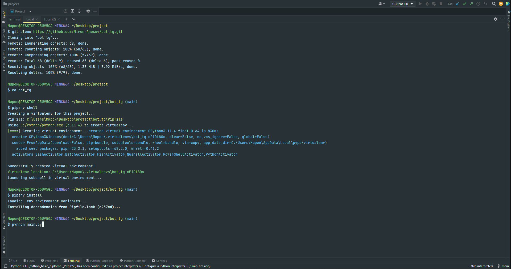
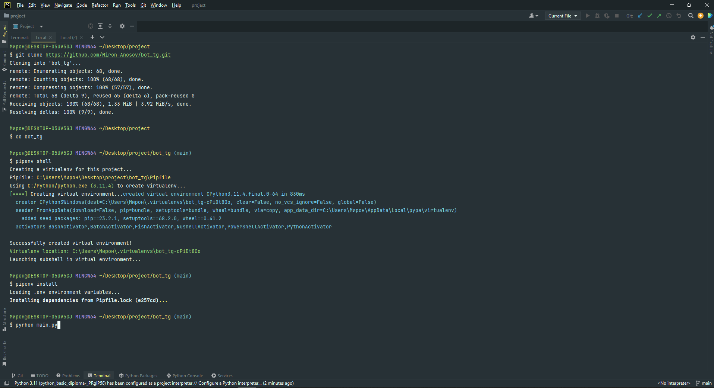
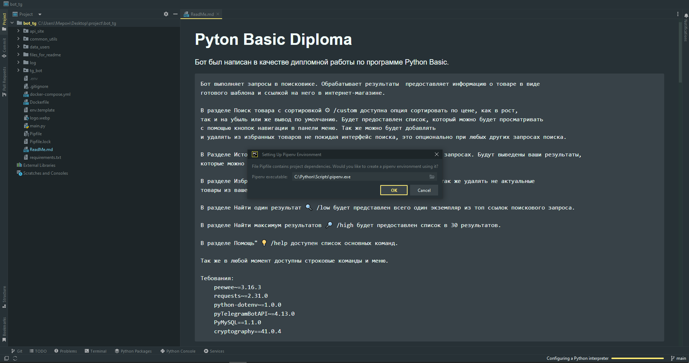
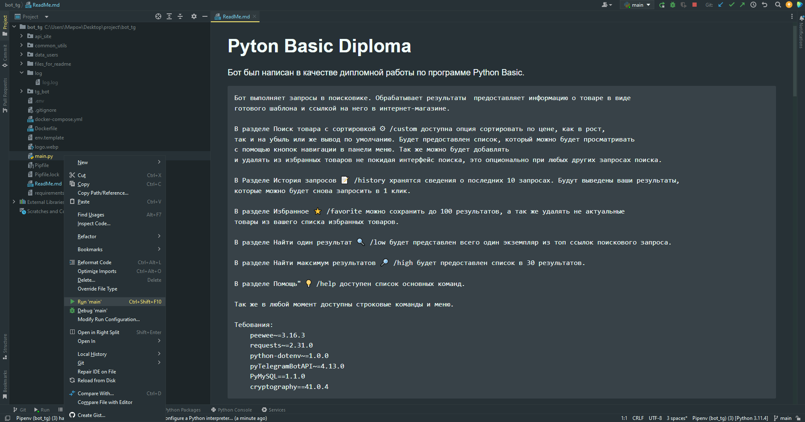
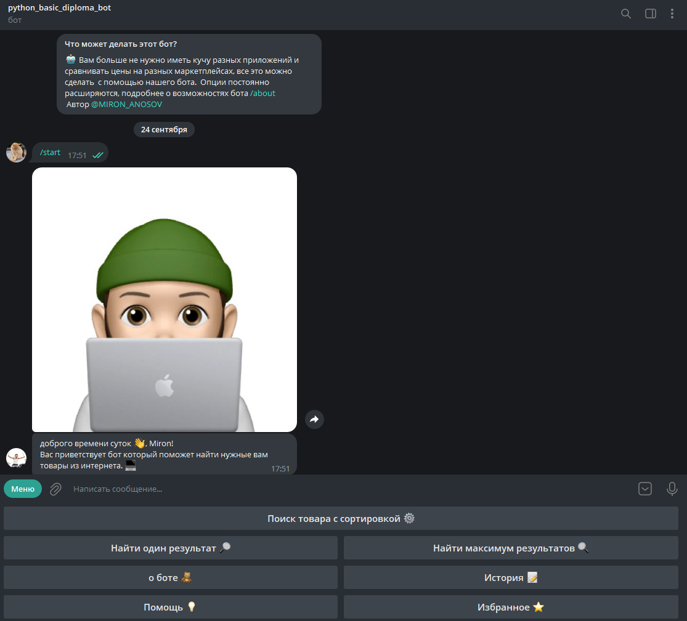
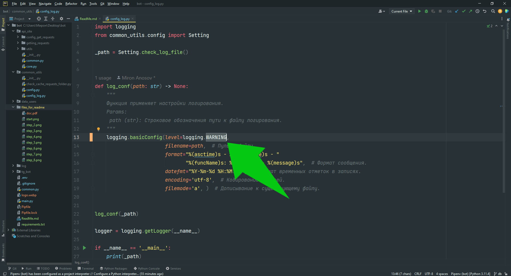

# Pyton Basic Diploma
Бот был написан в качестве дипломной работы по программе 
Python Basic.

    Бот выполняет запросы в поисковикe. Обрабатывает результаты  предоставляет информацию о товаре в виде 
    готового шаблона и ссылкой на него в интернет-магазине.

    В разделе Поиск товара с сортировкой ⚙ /custom доступна опция сортировать по цене, как в рост, 
    так и на убыль или же вывод по умолчанию. Будет предоставлен список, который можно будет просматривать
    с помощью кнопок навигации в панели меню. Так же можно будет добавлять
    и удалять из избранных товаров не покидая интерфейс поиска, это опционально при любых других запросах поиска.

    В Разделе История запросов 📝 /history хранятся сведения о последних 10 запросах. Будут выведены ваши результаты,
    которые можно будет снова запросить в 1 клик.

    В разделе Избранное ⭐️ /favorite можно сохранить до 100 результатов, а так же удалять не актуальные 
    товары из вашего списка избранных товаров.

    В разделе Найти один результат 🔍 /low будет представлен всего один экземпляр из топ ссылок поискового запроса.

    В разделе Найти максимум результатов 🔎 /high будет предоставлен список в 30 результатов.

    В разделе Помощь" 💡 /help доступен список основных команд.

    Так же в любой момент доступны строковые команды и меню.

    Требования:
        peewee~=3.16.3
        requests~=2.31.0
        python-dotenv~=1.0.0
        pyTelegramBotAPI~=4.13.0
        PyMySQL==1.1.0
        cryptography==41.0.4

### Короткая инструкция перед началом использования.

1. Запуск:  

Запускаем c Docker:

Запускаем в терминале:

Запускаем в PyCharm:
 
В корневом каталоге, после клонирования репозитория, создаем файл .env и вписываем согласно [env.template](env.template).  
Телеграм: [BotFather](https://t.me/BotFather)   API поискового ресурса: [API](https://rapidapi.com/letscrape-6bRBa3QguO5/api/real-time-product-search). 

2. Переходим в телеграм, в созданный вами бот и запускаем его командой /start или кнопкой в интерфейсе бота "Запустить".   
Бот удачно запущен, можно приступать к его тесту.

3. Если программа работает исправно, то нужно открыть файл common_utils/config_log.py для того что бы поменять настройки логирования. 
   При первом запуске настройки уставлены DEBUG. Нужно изменить на WARNING.

    

  
### Ссылки:  
[Документация ТЗ](files_for_readme/doc.pdf)  
[Документация к pyTelegramBotAPI](https://pytba.readthedocs.io/ru/latest/install.html)  
[Документация peewee](https://docs.peewee-orm.com/en/latest/)  
[Документация Pipenv](https://docs.pipenv.org/)  
[Документация Requests](https://requests.readthedocs.io/en/latest/)  
[Документация PyMySQL](https://pymysql.readthedocs.io/en/latest/)  
[Документация Docker](https://docs.docker.com/)
